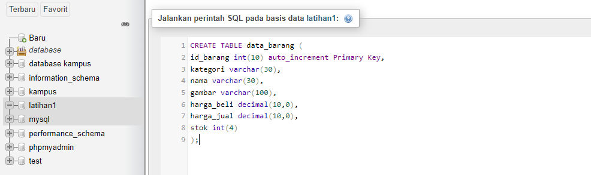
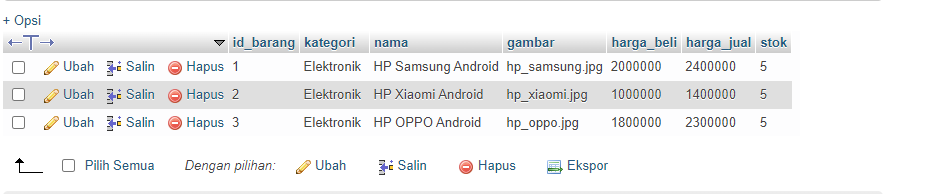
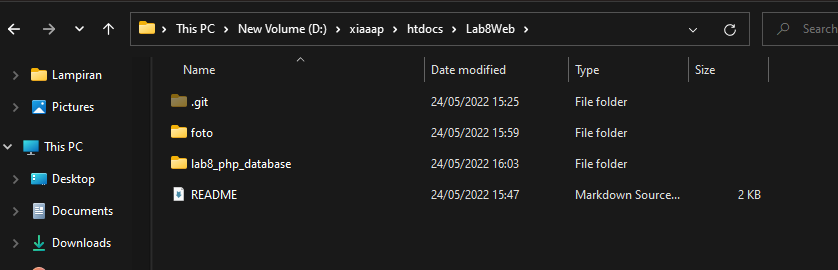
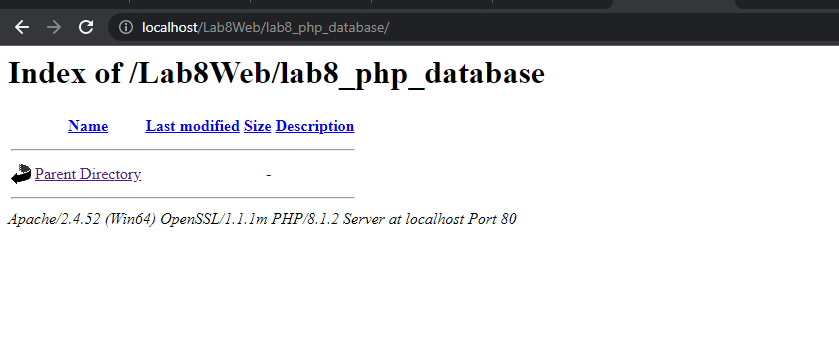

# Lab8Web

**NAMA : Fery Affandi** <br>
**Kelas : TI.20.A.1** <br>
**NIM : 312010018** <br>

## Langkah-langkah Praktikum

Untuk memulai membuat aplikasi CRUD sederhana, yang perlu disiapkan adalah
database server menggunakan MySQL. Pastikan MySQL Server sudah dapat dijalankan
melalui XAMPP.

### Menjalankan MySQL Server
Untuk menjalankan MySQL Server dari menu XAMPP Contol.


<p align="center">Gambar 8.1 XAMPP CONTROL

### Mengakses MySQL Client menggunakan PHP MyAdmin

Pastikan webserver Apache dan MySQL server sudah dijalankan. Kemudian buka
melalui browser: http://localhost/phpmyadmin/

## Membuat Database: Studi Kasus Data Barang

```php
CREATE TABLE data_barang (
id_barang int(10) auto_increment Primary Key,
kategori varchar(30),
nama varchar(30),
gambar varchar(100),
harga_beli decimal(10,0),
harga_jual decimal(10,0),
stok int(4)
);
```


<p align="center">Gambar 8.2 Tampilan PHPMyAdmin

## <b>Menambahkan data</b>

```php
INSERT INTO data_barang (kategori, nama, gambar, harga_beli, harga_jual, stok)
VALUES ('Elektronik', 'HP Samsung Android', 'hp_samsung.jpg', 2000000, 2400000, 5),
('Elektronik', 'HP Xiaomi Android', 'hp_xiaomi.jpg', 1000000, 1400000, 5),
('Elektronik', 'HP OPPO Android', 'hp_oppo.jpg', 1800000, 2300000, 5);
```


<p align="center">Gambar 8.3 Tampilan Data Barang

## Membuat Program CRUD

Buat folder <b>lab8_php_database</b> pada root directory web server (d:\xampp\htdocs)


<p align="center">Gambar 8.4 Directory lab 8

Kemudian untuk mengakses direktory tersebut pada web server dengan mengakses URL:
http://localhost/Lab8Web/lab8_php_database/


<p align="center">Gambar 8.5 Tampilan Web

## Membuat file koneksi database
Buat file baru dengan nama <b>koneksi.php</b> dan codingnya
```php
<?php
$host = "localhost";
$user = "root";
$pass = "";
$db = "latihan1";
$conn = mysqli_connect($host, $user, $pass, $db);
if ($conn == false)
{
echo "Koneksi ke server gagal.";
die();
} #else echo "Koneksi berhasil";
?>
```

Buka melalui browser untuk menguji koneksi database (untuk menyampilkan pesan
koneksi berhasil, *uncomment* pada perintah echo “koneksi berhasil”;>