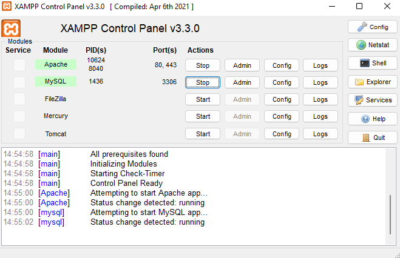

# Lab8Web

**NAMA : Fery Affandi**  
**Kelas : TI.20.A.1**  
**NIM : 312010018**  

## Langkah-langkah Praktikum

### Persiapan

Untuk memulai membuat aplikasi CRUD sederhana, yang perlu disiapkan adalah
database server menggunakan MySQL. Pastikan MySQL Server sudah dapat dijalankan
melalui XAMPP.

### Menjalankan MySQL Server
Untuk menjalankan MySQL Server dari menu XAMPP Contol.

