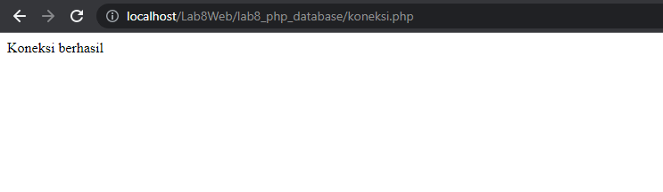
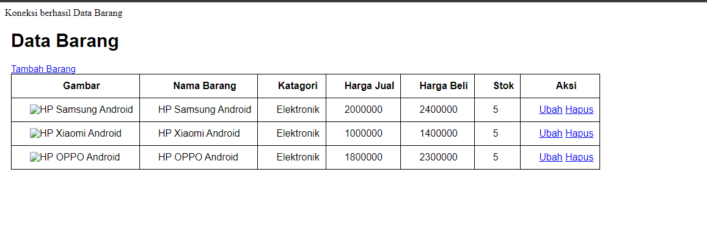

# Lab8Web

**NAMA : Fery Affandi** <br>
**Kelas : TI.20.A.1** <br>
**NIM : 312010018** <br>

## Langkah-langkah Praktikum

Untuk memulai membuat aplikasi CRUD sederhana, yang perlu disiapkan adalah
database server menggunakan MySQL. Pastikan MySQL Server sudah dapat dijalankan
melalui XAMPP.

### Menjalankan MySQL Server
Untuk menjalankan MySQL Server dari menu XAMPP Contol.


<p align="center">Gambar 8.1 XAMPP CONTROL

### Mengakses MySQL Client menggunakan PHP MyAdmin

Pastikan webserver Apache dan MySQL server sudah dijalankan. Kemudian buka
melalui browser: http://localhost/phpmyadmin/

## Membuat Database: Studi Kasus Data Barang

```php
CREATE TABLE data_barang (
id_barang int(10) auto_increment Primary Key,
kategori varchar(30),
nama varchar(30),
gambar varchar(100),
harga_beli decimal(10,0),
harga_jual decimal(10,0),
stok int(4)
);
```


<p align="center">Gambar 8.2 Tampilan PHPMyAdmin

## <b>Menambahkan data</b>

```php
INSERT INTO data_barang (kategori, nama, gambar, harga_beli, harga_jual, stok)
VALUES ('Elektronik', 'HP Samsung Android', 'hp_samsung.jpg', 2000000, 2400000, 5),
('Elektronik', 'HP Xiaomi Android', 'hp_xiaomi.jpg', 1000000, 1400000, 5),
('Elektronik', 'HP OPPO Android', 'hp_oppo.jpg', 1800000, 2300000, 5);
```


<p align="center">Gambar 8.3 Tampilan Data Barang

## Membuat Program CRUD

Buat folder <b>lab8_php_database</b> pada root directory web server (d:\xampp\htdocs)


<p align="center">Gambar 8.4 Directory lab 8

Kemudian untuk mengakses direktory tersebut pada web server dengan mengakses URL:
http://localhost/Lab8Web/lab8_php_database/


<p align="center">Gambar 8.5 Tampilan Web

## Membuat file koneksi database
Buat file baru dengan nama <b>koneksi.php</b> dan codingnya
```php
<?php
$host = "localhost";
$user = "root";
$pass = "";
$db = "latihan1";
$conn = mysqli_connect($host, $user, $pass, $db);
if ($conn == false)
{
echo "Koneksi ke server gagal.";
die();
} else echo "Koneksi berhasil";
?>
```

Buka melalui browser untuk menguji koneksi database untuk menyampilkan pesan
koneksi berhasil, *uncomment* pada perintah ```echo “koneksi berhasil”;>```


<p align="center">Gambar 8.6 Tampilan tes koneksi

## Membuat file index untuk menampilkan data <b>(Read)</b>
Buat file baru dengan nama ``index.php``

```php
<?php
include("koneksi.php");
// query untuk menampilkan data
$sql = 'SELECT * FROM data_barang';
$result = mysqli_query($conn, $sql);
?>
<!DOCTYPE html>
<html lang="en">
<head>
    <meta charset="UTF-8">
    <link href="style.css" rel="stylesheet" type="text/css" />
    <itle>Data Barang</title>
</head>
<body>
    <div class="container">
        <h1>Data Barang</h1>
    <div class="main">
        <table>
            <tr>
                <th>Gambar</th>
                <th>Nama Barang</th>
                <th>Katagori</th>
                <th>Harga Jual</th>
                <th>Harga Beli</th>
                <th>Stok</th>
                <th>Aksi</th>
            </tr>
                <?php if($result): ?>
                <?php while($row = mysqli_fetch_array($result)): ?>
            <tr>
                <td>" alt="<?=$row['nama'];?>"></td>
                <td><?= $row['nama'];?></td>
                <td><?= $row['kategori'];?></td>
                <td><?= $row['harga_beli'];?></td>
                <td><?= $row['harga_jual'];?></td>
                <td><?= $row['stok'];?></td>
                <td><?= $row['id_barang'];?></td>
            </tr>
                <?php endwhile; else: ?>
            <tr>
                <td colspan="7">Belum ada data</td>
            </tr>
            <?php endif; ?>
        </table>
    </div>
    </div>
</body>
</html>
```
<br>


<p align="center">Gambar 8.7 Tampilan Index

## Menambah Data (Create)
Buat file baru dengan nama <b>`tambah.php`</b>

```php 
<?php
error_reporting(E_ALL);
include_once 'koneksi.php';

if (isset($_POST['submit']))
{
    $nama = $_POST['nama'];
    $kategori = $_POST['kategori'];
    $harga_jual = $_POST['harga_jual'];
    $harga_beli = $_POST['harga_beli'];
    $stok = $_POST['stok'];
    $file_gambar = $_FILES['file_gambar'];
    $gambar = null;
    if ($file_gambar['error'] == 0)
    {
        $filename = str_replace(' ', '_',$file_gambar['name']);
        $destination = dirname(__FILE__) .'/gambar/' . $filename;
        if(move_uploaded_file($file_gambar['tmp_name'], $destination))
        {
            $gambar = 'gambar/' . $filename;;
        }
    }
    $sql = 'INSERT INTO data_barang (nama, kategori,harga_jual, harga_beli,stok, gambar) ';
    $sql .= "VALUE ('{$nama}', '{$kategori}','{$harga_jual}','{$harga_beli}', '{$stok}', '{$gambar}')";
    $result = mysqli_query($conn, $sql);
    header('location: index.php');
}
?>
<!DOCTYPE html>
<html lang="en">
<head>
    <meta charset="UTF-8">
    <link href="style.css" rel="stylesheet" type="text/css" />
    <title>Tambah Barang</title>
</head>
<body>
    <div class="container">
        <h1>Tambah Barang</h1>
        <div class="main">
            <form method="post" action="tambah.php"enctype="multipart/form-data">
                <div class="input">
                    <label>Nama Barang</label>
                    <input type="text" name="nama" />
                </div>
                <div class="input">
                    <label>Kategori</label>
                    <select name="kategori">
                        <option value="Komputer">Komputer</option>
                        <option value="Elektronik">Elektronik</option>
                        <option value="Hand Phone">Hand Phone</option>
                    </select>
                </div>
                <div class="input">
                    <label>Harga Jual</label>
                    <input type="text" name="harga_jual" />
                </div>
                <div class="input">
                    <label>Harga Beli</label>
                    <input type="text" name="harga_beli" />
                </div>
                <div class="input">
                    <label>Stok</label>
                    <input type="text" name="stok" />
                </div>
                <div class="input">
                    <label>File Gambar</label>
                    <input type="file" name="file_gambar" />
                </div>
                <div class="submit">
                    <input type="submit" name="submit" value="Simpan" />
                </div>
            </form>
        </div>
    </div>
</body>
</html>
```